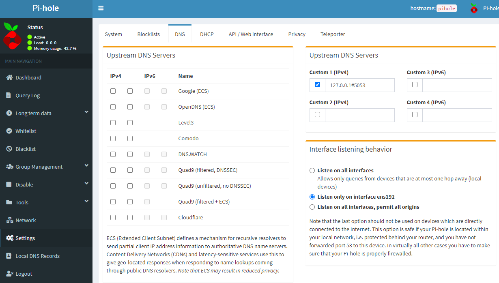

# cloudflare-doh
Installation of cloudflare's DoH (DNS over HTTPS) using cloudflared

## Installation
To install cloudflared, simple clone this repository, give the script execute permissions, and run as sudo (or root).
```bash
git clone https://github.com/kennyparsons/cloudflare-doh.git
cd cloudflare-doh
chmod +x install-cloudflared.sh
./install-cloudflared.sh
```

Cloudflared will be configured to automatically run on boot (via systemd). Running this script will also install an update script, which can be run simply with `update-cloudflared`.

## Usage
If using pi-hole, using cloudflared is very simple. After installation, change your upstreamd DNS to the ip address:port of the server running cloudflared. If running on the same server as pi-hole (recommended), it would be `127.0.0.1#5053`.


